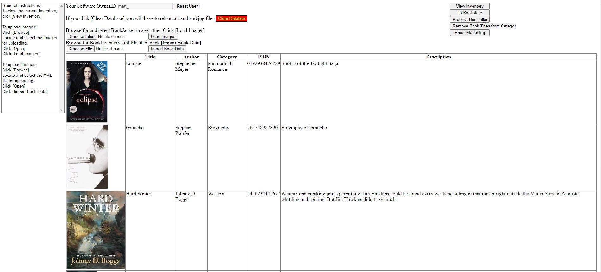
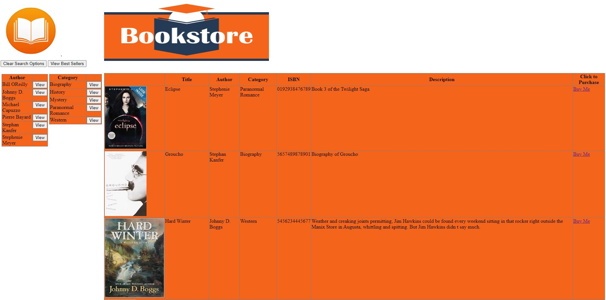
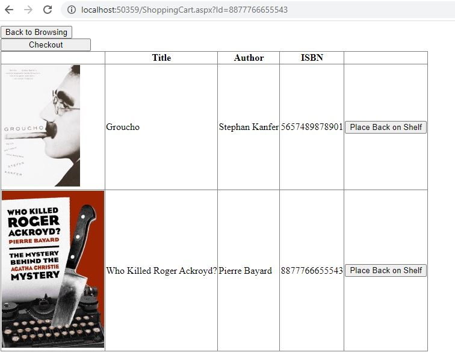
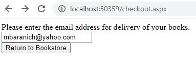

# Bobs Book Nook
CRUD Application Displaying a Book Store.

## Table of Contents
* [General Info](#general-information)
* [Technologies Used](#technologies-used)
* [Features](#features)
* [Screenshots](#screenshots)
* [Usage](#usage)
* [Acknowledgements](#acknowledgements)

## General Information
- Application was the Final Project to earn ASP.Net/C# Certification.

## Technologies Used
- .Net Framework 4.8
- .Net Data Provider for SQL Server (Transact-SQL)

## Features
List the ready features here:
- Upload inventory using XML.
- Upload images to accompany the data.
- Create unique OwnerID to manage your database.
- Filter catergories. Allow user Admin to edit database via UI.
- User adds books into Shopping Cart to checkout with thier email.

## Screenshots

## Usage
How does one go about using it?
- Navigate to /admin.aspx
- Setup owner ID in textbox.
- Upload BookInventory.xml using Import Book Data
- Upload Images using Load Images

- Plenty of options to navigate using Right Side of Admin Page 
- Add books to Shopping Cart by selecting Buy Me on Right Side of Default.aspx
- User can navigate back to Default to add more books or Checkout.
- Input email address and view total.

## Acknowledgements
Give credit here.
- This project was provided to me by Macomb Community College.

